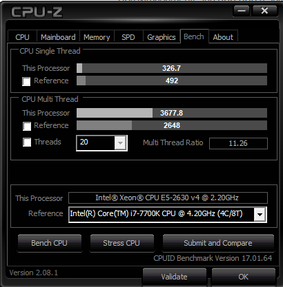
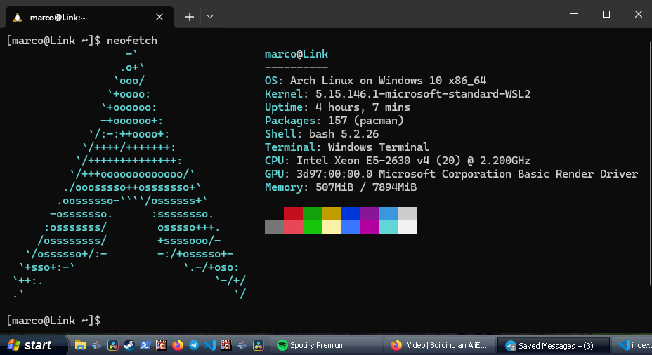

<iframe style="width: 100%;" height="415" src="https://www.youtube-nocookie.com/embed/4U2xLQMMuJM?si=dvrvMTjfr7W8zqTn" title="YouTube video player" frameborder="0" allow="accelerometer; autoplay; clipboard-write; encrypted-media; gyroscope; picture-in-picture; web-share" referrerpolicy="strict-origin-when-cross-origin" allowfullscreen></iframe>

So, a few days ago i bought a new case for my old gaming PC that i built in the covid 19 period to play games, my old case was very old and it was falling apart, literally. So a made a video explaining how i transferred the parts to the new case.

After the pc was ready to use, i then installed the PC in my living room to play games in my TV using my XBOX controller, the problem is, my office didn't have any PC anymore. Thats when i have an idea to build a new PC using parts from Ali Express, such as the RAM, Processor and motherboard.

Here in Brazil, the pc parts are very expensive, like anything else, so the brazilians in general started to buy parts from Ali Express, the most famous parts are custom motherboards that already come with a xeon processor.

It all makes sense, instead of the Xeon CPUs going to the trash because they would be replaced by newer models, the manufacture instead makes consumer grade motherboards that accepts this kinda of server CPUs, with a very low cost per performance.

The cost of a motherboard with a CPU is around R$230 to R$400 with taxes, approximately 45 dollars, which is perfect, because in Brazil, all international sells that surpass 50 Dollars is taxed around 92% of the value of the product, the products bellow USD50 the taxes are way lower. 

Before the current government, this 92% tax was random, sometimes the buyer had to pay, sometimes not, but now with this government, it is confirmed that the buyer must pay the taxes. And they don't wanna stop there, they also want to increase the taxes to 113% and remove the USD50 limit. I think that the only thing that the Lula government did was raise taxes to the poor.

</img>

> Context: This is a meme showing the current brazilian economy minister Saying: "What are you looking at? Do you wanna be taxed?"

# Why those Ali Express parts are getting famous in Brazil?

As you can probably imagine, Brazil is not one of the best countries of the world to be born, the minimum wage is a joke, only R$1412, around 278 dollars, but the thing is, while we have very high taxes like, for example, sweden, the state doesn't provide any good services, for example, the free healthcare is a meme, the education rates are getting worst every year, we are one of the unsafest countries of the world, it is not common for a foreigner to think of something of Brazil and the first thing that they think of is the violence.

A motherboard like the Aorus B450 costs 658 Reais, a Ryzen 5600G CPU costs 878 Reais, this alone already is worth more than the minimal wage, it is very common to see a lot of brazilians houses that don't have a lot of new tech, in fact, the PS2, PS3 and Xbox 360 are still one of the most played video games here.

And then, suddenly, all of this brazilians that never in they live dreamed about having a gaming computer, now can buy a motherboard with a processor that have similar performance with an i7 7700K, for only 250 Reais. This is completely mind blowing, now it is very common to see a lot of videos of people building PCs that cost in total 1500 Reais, usually with this kind of motherboard and a RX580, a very cheap and capable option still to this day.

</img>

I figure this video that i made would be a great opportunity for me to show a little bit of context of how is life here in Brazil, i hope you liked!

