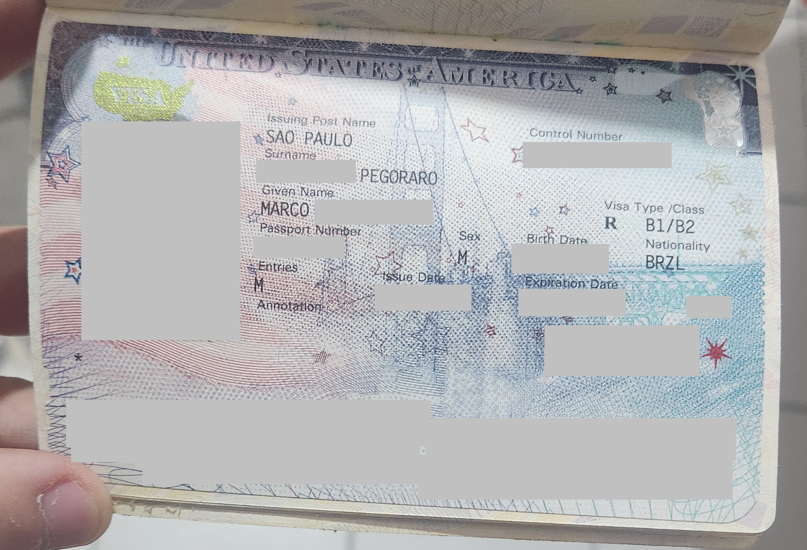

## Introdução

> Antes de iniciar esta carta, gostaria de dizer primeiramente que essa carta não é sobre o povo italiano, muito menos a rica cultura italiana que influenciou e influencia o mundo no qual vivemos até hoje como a arte e a culinária, esse post é sobre as decisões absurdas do governo italiano a respeito da limitação ao direito de sangue da cidadania italiana e somente isso. Também me reservo do direito de escrever utilizando minha lingua materna, que é o português brasileiro, até poderia tentar escrever em italiano mas me recuso depois das decisões já citadas anteriormente neste paragrafo. 

<a href="https://pegoraro-dev.translate.goog/posts/cidadania-italiana?_x_tr_sl=pt&_x_tr_tl=it&_x_tr_hl=pt-BR&_x_tr_pto=wapp">
    <button style="display: flex;align-items: center;background-color: #4285F4;color: white;border: none;padding: 10px 15px;font-size: 16px;cursor: pointer;border-radius: 5px;" class="translate-button">
      ℹ️🇮🇹👉 Clicca qui per leggere questo post in italiano
    </button>
</a>

 
Resolvi escrever essa carta para expressar minha indignação a decisão recente do governo italiano por através de uma medida provisória de limitar o reconhecimento da cidadania italiana para descendentes no qual o cidadão originário da Italia seja acima da segunda geração, ou seja, bisnetos e trisnetos de um cidadão italiano reconhecido pela Italia não teriam o direito de reconhecimento de cidadania mais.

Essa decisão é um desrespeito com todos os cidadãos italianos no qual nasceram no exterior, sendo eles Brasileiros, Argentinos, Americanos, etc. Esses mesmos italianos que, ao perceberem que a Italia os abandonou no passado, tentaram uma nova vida em outro país, muitos desses italianos morreram no processo, mesmo assim, os que sobreviveram e não morreram por doenças, conseguiram construir algum patrimonio no novo país, deixando assim descendentes nos quais fizeram de tudo para levar a cultura adiante.

Durante o período da segunda guerra mundial, o brasil vivia uma ditadura nas mãos de Getúlio Vargas, no qual incorporou diversas leis fascistas (No sentido literal da palavra) que penduram até os dias de hoje, como por exemplo a CLT, que era a "Carta de Lavoro" de Mussolini só que copiada para o Brasil.

Nesse período, foi criado uma lei que obrigava as pessoas a falarem somente o português brasileiro, qualquer pessoa que fosse pego falando outro idioma seria punido ou até preso.

Não precisa nem dizer que isso afetou demais as inúmeras colonias de outros países no brasil, era comum as pessoas terem medo de falar umas com as outras com medo de serem denunciadas a policia, nisso, a maioria das familias que tinham ancestralidade de algum país, se viram obrigadas a falar somente o portugues, deixando a cultura de seus países originarios perdidas.

Graças a Deus algumas cidades no brasil preservaram a cultura viva, como é o caso das seguintes cidades:

- Pomerano:
  - - Pomerode - Santa Catarina
  - - Santa Maria de Jetibá - Espírito Santo
- Italiano:
  - - Nova Veneza - Santa Catarina
  - - Bento Gonçalves - Rio Grande do Sul
  - - Antônio Prado - Rio Grande do Sul
- Alemão:
  - - Blumenau - Santa Catarina
- Japonês:
  - - Assaí - Parana
  - - São Paulo - São Paulo 
  - - - Bairro da liberdade 
- Lingua Letã:
  - - Tupã - São Paulo
  - - - Distrito de Varpa

Mas a maioria das famílias por todo o Brasil, no qual tiveram origens de outros países, acabaram perdendo a lingua e a cultura de seus antepassados.

Claramente essa decisão é puramente feita para afetar os italianos nascidos no Brasil e na Argentina (Perceba que não falei Brasileiros e Argentinos, pois isso daria a falsa impressão que são pessoas de outras nacionalidades tentando obter a cidadania italiana, sendo que essas pessoas já são italianas, basta somente fazer o reconhecimento perante ao governo italiano), eu gostaria muito de saber se esse tipo de tratamento seria igual caso a maioria dos descendentes de italianos morassem nos Estados Unidos ou Canada.

Mas chega de falar de história e especulações sobre o que aconteceria em cenários fictícios, gostaria agora de argumentar por que essa decisão do Antonio Tajani é péssima.

A começar pelo fato da Italia estar tendo um declínio populacional a quase vinte anos, um quarto da Italia é composta por pessoas com mais de 65 anos, é fato que em alguns anos se nada mudar, o sistema de previdência social da Italia irá colapsar. 

Um dos argumentos utilizados pelo ministro é que as pessoas reconhecem a cidadania italiana somente para ir para miami, isso é uma mentira, ele não apresenta dados por que não favorece a narrativa dele, tenho certeza que a maioria das pessoas que reconhecem a cidadania não utilizam para tirar o ESTA e ir para os estados unidos pois muitas vezes já tem, eu mesmo tenho o visto de turista para os estados unidos, não preciso de um passaporte vermelho para viajar para lá.

Tenho certeza que a maioria das pessoas que reconhecem a cidadania italiana ficam no brasil mesmo, obtêm para passar para os filhos para que um dia os mesmos possam um dia talvez se mudar para a Italia. E mesmo que a utilizem para morar em outro país do espaço Schengen, talvez eles façam iguais os ITALIANOS que nascem na Italia e quando chega a hora de entrar no mercado de trabalho, começam a procurar empregos na Alemanha, Holanda, ou em outros países mais ricos da Europa, vocês sabem do que estou falando.

Mesmo que só 1% dos que reconhecem cidadania vão para a Italia, já valeria a pena, não só por começarem a contribuir para a economia Italiana, como também deixarão descendentes alinhados com a cultura Italiana. Outro ponto estupido utilizado pelo ministro é que as pessoas que reconhecem utilizam o sistema de saúde publico gratuitamente, isso é mentira, pois não sei se vocês sabem, mas só pode utilizar o sistema de saúde quem tem residencia registrada em algum comune italiano, ou seja, já mora na Italia. Talvez o ministro queira nos dizer com essa frase que mesmo que fossemos morar na Italia, não seriamos bem vindos, vai saber.

Outro ponto não citado pelo excelentíssimo ministro é a quantidade de dinheiro que entra nos cofres italianos para cada requerimento de cidadania, faz alguns anos que, para requisitar via consulado, o requerente deveria pagar 300 euros, o que é um absurdo por sí só, pois é um serviço que deveria ser gratuito, é um cidadão de um país mostrando as provas (certidões) que o mesmo é um cidadão italiano de fato, e neste ano, foi aumentado para 600 euros.

Vale ressaltar que a fila consular para reconhecimento é de aproximadamente 10 anos (imagine as pessoas que estavam na fila quase sendo chamadas e tendo o sonho da vida delas destruído por conta da decisão de uma pessoa). Se você não estiver disposto a esperar boa parte da sua vida por um direito que já deveria ser seu, poderia seguir com a via judicial, que é a qual você contrata diretamente um advogado italiano para processar o governo italiano pela demora nas filas consulares, que pela lei, deveria durar no máximo dois anos, antigamente para protocolar o processo, custava 550 euros, agora são 600 euros para cada requerente, ou seja, caso tenha eu e mais 3 primos querendo reconhecer a cidadania, deveríamos pagar 2400 euros.

Também vale citar o famoso "business" que o ministro fala no anuncio, em primeiro lugar, não deveria existir business, sabe por que existe? Por que o governo italiano é extremamente ineficiente, esse dinheiro que os requerentes enviam pra Italia são usados pra que? deveriam ser usados para agilizar os processos, mas não agilizaram nada, existem diversos países ao redor do mundo que já modernizaram muitas areas burocráticas, o Brasil inclusive é muito mais avançado nesse quesito, consigo fazer assinaturas eletrônicas direto da minha casa, mas para não humilhar muito, posso utilizar o exemplo da Estonia, que é um país extremamente modernizado.

A empresa que anuncia uma "black friday", não faz isso para as pessoas "ganharem" cidadania, é para ajudar quem quer reconhecer e precisaria de uma promoção para tal, pois mesmo o Brasil sendo um país em desenvolvimento, existem pessoas nas quais tem genuíno interesse em reconhecer uma cidadania. Ninguém que começa um processo de cidadania vai na intenção de "ganhar", eles vão na intenção de RECONHECER, e para tal, se gasta MUITO dinheiro com certidões, ligações aos cartórios brasileiros, viagens que precisam ser feitas para cidades a 400km de distancia só para saber se tem a possibilidade de tal certidão estar lá. As pessoas na maioria das vezes gastam o dinheiro que não tem só para ter a possibilidade de montar a arvore genealógica para reconhecimento da cidadania.

> Então, senhor excelentíssimo ministro, antes de ficar chateado por existir "black friday" de cidadania, faça o seu trabalho direito que talvez os brasileiros não precisem de assessoria para reconhecer.

## O que vou fazer agora? 

Agora contando um pouco sobre mim, eu estou em um processo judicial para o reconhecimento da minha cidadania italiana desde 2023, desde então, acompanho o andamento no aplicativo Giustizia Civile, e fico extremamente chateado que no meu processo, o juiz foi designado porém até hoje não marcou uma data para a audiência, quase dois anos e minha familia está tendo esse tratamento. 

Não sei o que vai acontecer agora, se meu processo se enquadrará nas regras antigas, no qual não havia limites de gerações ou mesmo que o processo tenha sido iniciado antes, na data do julgamento, sera levado em conta a regra atual, mas uma coisa é certa, o governo italiano tem ódio de mim e não me quer lá, assim como não quer milhões de pessoas que querem reconhecer a cidadania italiana.

Sim, eu sei que tem pessoas que querem reconhecer a cidadania que não estão nem ai pra Italia, tem esse tipo de gente em qualquer lugar, mas e as pessoas que querem reconhecer pois querem se reconectar com o país? Vão simplesmente virar as costas? 

Desde que comecei meu processo, procuro conhecer mais sobre a Italia, pois pra mim ter a cidadania de um país é ter novas responsabilidades, então comecei a pesquisar sobre a cultura, as regiões, de onde meu antepassado veio, como era naquela época. Comecei a aprender a culinária, a cultura, de como a Italia como conhecemos hoje se formou, tudo isso. Além do fato de aprender a lingua também, estava em uma ofensiva de quase 700 dias de italiano, antes mesmo de começar meu processo já estava começando a aprender a lingua, de tando que comecei a me interessar pela Italia.

Mas tudo isso parece que não tem importância para o governo italiano, pra ele eu só quero meu passaporte pra "ir para Miami", então não tem problema, a partir de hoje deixarei de aprender italiano pra começar a aprender uma lingua mais util, como o espanhol, francês ou alemão, não me decidi ainda. Também pararei de acompanhar todos os canais de brasileiros que vivem na Italia mostrando como é o dia a dia, o que pode fazer, o que não pode, pois esse conhecimento que aprendi foi tudo jogado no lixo.

No futuro, se a lei ficar como está hoje e eu não conseguir reconhecer minha cidadania, tudo bem, não tem problema, eu procuro um lugar que me queira, e não são poucos. Mas caso eu seja reconhecido, não vou poder passar para meus filhos pois eles teriam que nascer na Italia ou eu teria que ter morado dois anos na Italia, então se eu quisesse muito ter um passaporte vermelho, preferiria moraria dois anos não na Italia, mas sim na Espanha, país no qual reconhece a qualidade dos latinos americanos e nos naturalizam com dois anos de moradia.

É uma pena a Italia ter abandonado os Italianos nascidos fora da Italia mas pelo menos, caso eu opte pela Espanha, meus filhos vão morar em um país no qual aceitam ele pelo que eles são, diferente da Italia onde não são poucos os casos de preconceitos com os brasileiros, eu sei disso pois passei boa parte desses últimos dois anos vendo relatos de brasileiros sofrendo preconceito, inclusive até pela cor da pele.

Mas é isso, foi bom enquanto durou, Italia, se o tipo de imigrante que você quer é outro, e todos nós sabemos o tipo de imigrante que vocês estão querendo, não preciso falar mais nada. Giorgia Meloni prometeu que iria acabar com a imigração ilegal, e até agora não fez nada, mas quando é pra limitar quem realmente tem sangue italiano fazem um show, tendo direito até a matéria em jornal falando a favor do governo, não é mesmo RAI? Mas não tem problema, daqui uns 10 ou 15 anos a Italia deixará de existir como conhecemos hoje e ai estarão implorando por latino americanos, mas ai será tarde demais.