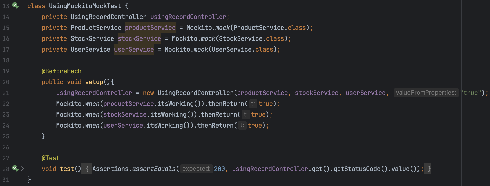
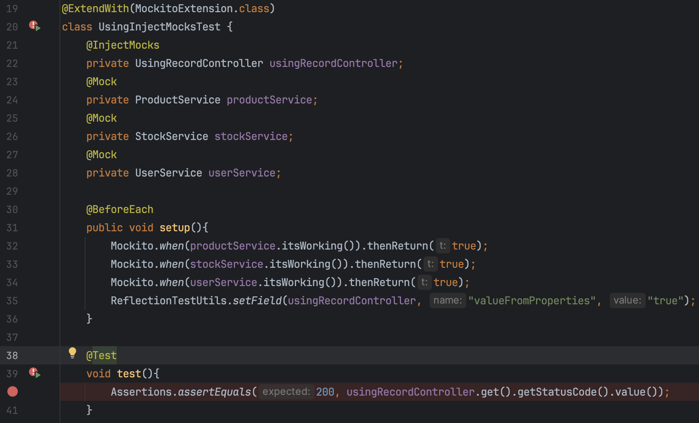

As you probably know, there are two ways to perform dependency injection in a Spring component, by using constructor: 

```java
@Component
public class GreetingController {

    private GreetingService greetingService;

    public GreetingController(GreetingService greetingService) {
        this.greetingService = greetingService;
    }

} 
```
Or by using the ``@Autowired`` annotation:

```java
@Component
public class GreetingController {

    @Autowired
    private GreetingService greetingService;

} 
```

When I was a junior developer, I really liked how the @Autowired annotation worked. I thought it was easier to use compared to the constructor method — just one annotation on each dependency and you’re good to go. Not to mention, you don’t need to create a constructor for the class.

But as time went on, I realized that this is the worse method for doing dependency injection, for a few reasons:

1. It can't guarantee that the dependencies aren't ``null`` at compile time.
2. It uses reflections in Java to instantiate the dependencies instead of constructing the object in the "normal way"
3. It makes unit testing more difficult — you're forced to use the @Mock and @InjectMocks annotations, and you can't simply mock each dependency and instantiate the class manually.
3. 1. And if you need to mock a @Value variable inside the class, you have to use ReflectionTestUtils. The code becomes much uglier than it needs to be. With constructor injection, you could just pass the string as a parameter.
4. When you have a very large class with lots of dependencies, it starts to look redundant, with many lines using just the @Autowired annotation.

These were some of the reasons why I started using constructor-based dependency injection in Java. But there’s still one thing that bothers me: having to create the constructor and manually assign the dependencies.

```java
@Component
public class TestUseCase {

    private final UserService userService;
    private final ProductService productService;
    private final StockService stockService;
    private final String valueFromProperties;

    public TestUseCase(
      final UserService userService;
      final ProductService productService;
      final StockService stockService;
      @Value("${valueFromProperties}") final String valueFromProperties;
    ) {
        this.userService = userService;
        this.productService = productService;
        this.stockService = stockService;
        this.valueFromProperties = valueFromProperties;
    }

    //code
} 
```

Look at how big the constructor gets — it's filled with boilerplate code. I get tired just looking at it. The solution? Good old <a href="https://projectlombok.org" target="_blank">Lombok</a>.

If you're a Java developer, you most certainly know Lombok, so I won’t go into too much detail. But there are a few different annotations used to generate constructors:

<a href="https://projectlombok.org/features/constructor" target="_blank">
@NoArgsConstructor <br/>
@AllArgsConstructor <br/>
@RequiredArgsConstructor <br/><br/>
</a>

The annotation we're interested in is the last one: ``@RequiredArgsConstructor``. It automatically generates a constructor for all the required dependencies marked with the final keyword, like this:

```java
@Component
@RequiredArgsConstructor
public class TestUseCase {

    private final UserService userService;
    private final ProductService productService;
    private final StockService stockService;
    private final String valueFromProperties;

    //code
} 
```

Look at how all the boilerplate code is now gone with just this one annotation. But there's still a problem with this code — can you guess what it is?

It's the fact that we're not specifying the value that valueFromProperties should be filled with using the @Value annotation. To fix this, we still need to use the @Value annotation above the variable, like this:

```java
@Component
@RequiredArgsConstructor
public class TestUseCase {

    private final UserService userService;
    private final ProductService productService;
    private final StockService stockService;
    @Value("${valueFromProperties}")
    private final String valueFromProperties;

    //code
} 
```

And that’s everything you need! But still, if this code doesn’t work and you’re getting an error like this one:


You're probably using an older version of Java or Lombok. If that’s the case, Lombok might not automatically apply the ``@Value`` annotation in the generated constructor. To fix this, you’ll need to create a file called ``lombok.config`` in the same folder as your ``pom.xml`` or ``build.gradle``. Inside that file, add the following lines:

```
lombok.copyableAnnotations += org.springframework.beans.factory.annotation.Autowired
lombok.copyableAnnotations += org.springframework.beans.factory.annotation.Value
```

Of course, you could just use the ``@Value`` annotation on a non-final variable, and it would work. But the problem is that you'd need to use ReflectionTestUtils in your unit tests.

By using the final keyword, you can create the component instance by passing the value directly into the constructor — which makes your code cleaner and your tests much simpler.

And that’s why, in my opinion, constructor-based dependency injection is the best approach in Spring.

You can check out the full code in the following repository:

https://github.com/marcoagpegoraro/spring-dependency-injection-the-best-way

I'm using Java 8 here just to demonstrate how the ``lombok.config`` file works. Depending on your Java and Lombok versions, you may or may not need it.

To check whether you need the config file, open the target folder and inspect the generated .class file. Look at the constructor — if the ``@Value`` annotation appears in the constructor parameters (as shown in the example below), then you're good to go.


See ya.

## EDIT

Well, I recently found out there’s another way to handle this. If you’re using a version of Java prior to 14, you’ll need to rely on Lombok. But if you’re using Java 14 or later, you also have the option to use Java Records. So in this edit, I’ll show you how to implement dependency injection using records.

Records are a new type of Java class that automatically provides many of the features you'd normally use Lombok for, such as:

- private, final field for each piece of data
- getter for each field
- public constructor with a corresponding argument for each field
- equals method that returns true for objects of the same class when all fields match
- hashCode method that returns the same value when all fields match
- toString method that includes the name of the class and the name of each field and its corresponding value

> Albano, J. (January 16, 2024). <i>Java record keyword.</i> Baeldung. Retrieved April 22, 2025, from https://www.baeldung.com/java-record-keyword

One of the main benefits here is that Java Records automatically generate a public constructor for all fields, which means we can ditch Lombok entirely for this use case.

The code would look like this:

```java
@Component
public record TestUseCase(
    UserService userService,
    ProductService productService,
    StockService stockService,
    @Value("${valueFromProperties}") String valueFromProperties
)
{
   //code 
}
```

Look how much easier it is to implement it this way! However, be careful: when using a record as a component, you can’t use ``ReflectionTestUtils`` to set variables annotated with ``@Value``.

If you want to test a record-based component, the recommended approach is to use Mockito.mock, like this:



This approach works for both @RequiredArgsConstructor-based classes and Java record implementations.



Now, if you're using a regular class with ``@RequiredArgsConstructor``, in addition to Mockito.mock, you also have the option to use ``@InjectMocks``.

But here's the catch: if you try to use ``@InjectMocks`` with a Java record, it won't work and will throw an ``IllegalStateException`` like this:

<font color="red">

> java.lang.IllegalStateException: Could not access method or field: Can not set final java.lang.String field com.marcoagpegoraro.spring_dependency_injection_the_best_way.controller.UsingRecordController.valueFromProperties to java.lang.String
</font>

I highly recommend using the Mockito.mock approach because it leads to cleaner, more intuitive code. It’s easier to read and understand, and it's consistent with patterns used in many other programming languages. But in the end, it’s up to you and your team to decide what works best for your context.

Another important thing to keep in mind when using Java records as components is that they’re only suitable for stateless components. For example, if you have a variable inside the component that needs to change over time, you can’t use a record — all fields in a record are implicitly final. That said, I believe this is a pretty rare use case in most applications, but it’s definitely something to be aware of.

And that’s it — see ya! 👋