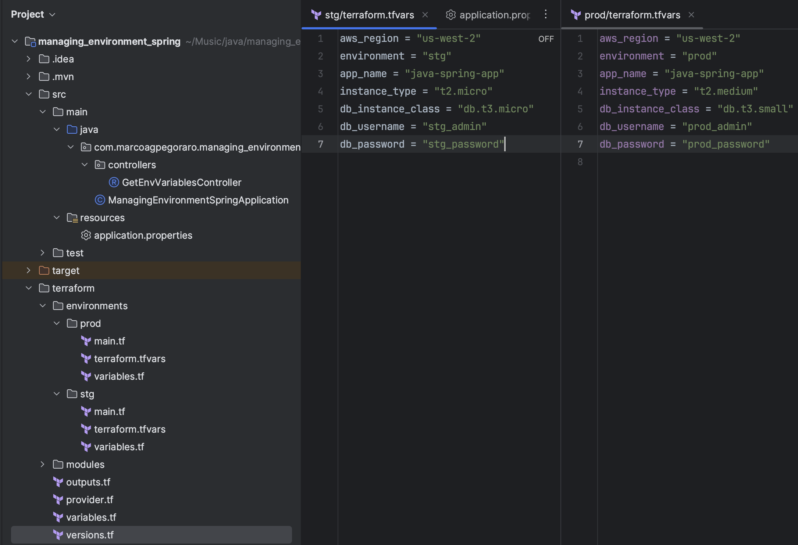

Let's suppose that you have a spring application, and then you need to run this application locally in your machine, in the staging and production environment.

One of the default aproches that Java developers like to use is to create an application.properties file for each environment, like this:
<center>


</center>

And it is a fair way to segregate the environment variables by files, it's very easy for beginners to understand id and also it's easy to tell spring to use a specified file, you just need to declare the spring.profiles.active env variable in the IntelliJ run configuration with the value corresponding to the desired environment and you are good to go.
<center>


</center>

In this article, i will demonstrate a better approach that shines when you are using infrastructure as code.

For this demonstration, i created a new spring project with just spring web for us to see the variables when the application run, then i created a controller like this:

```java
@RestController
public record GetEnvVariablesController(
        @Value("${sns.topic.name}") String snsTopicName,
        @Value("${sqs.queue.name}") String sqsQueueName,
        @Value("${api.url}") String apiUrl,
        @Value("${kafka.topic.name}") String kafkaTopicName
) {

    @GetMapping
    public ResponseEntity<List<String>> get(){
        return ResponseEntity.ok(List.of(snsTopicName, sqsQueueName, apiUrl, kafkaTopicName));
    }

}
```

And then I created three files called application.properties, application-stg.properties and application-prod.properties. Each one of then have the same four variables, the only difference is the suffix in the end of the values, containing the corresponding environment:

```
sns.topic.name=sns-topic-name-stg
api.url=http://wow-stg.com

sqs.queue.name=sqs-topic-name-equal-for-every-env
kafka.topic.name=kakfa-topic-name-equal-for-every-env
```

Now, if we run the application passing the desired environment, it will run without any problem:
<center>


</center>

And then, in your Dockerfile, the only thing that you need to do is pass the environment in the container 

# How can we make it better?

This approach looks great when you are running the application locally or even running inside a container in a VPS, but lets suppose you have some sort of secret that the application needs to know to connect to an API or database, now you can't put these variables into the properties files.

The best way to make the application read these variables is to use container environment variables. In other programming languages, you usually have a .env file that the application automatically reads to know the secret variables, but in spring we can do something witch I believe is one of the best aproches to the problem.

We are going to delete all the specific application properties files, leaving only the default "application.properties", and then inside of it, you are going to note every variable that changes from environment to environment, for example, URLs, topic names, etc.

In our example above, only the SNS and the URL are variables that changes from file to file, so we are gonna create container specific variables for then.

```
sns.topic.name=${SNS_TOPIC_NAME:sns-topic-name-local}
api.url=${API_URL:http://wow-local.com}

sqs.queue.name=sqs-topic-name-equal-for-every-env
kafka.topic.name=kakfa-topic-name-equal-for-every-env
```

Look what's happening now, I'm passing to the "sns.topic.name" the value of the container variable "SNS_TOPIC_NAME", but if it doesn't exists, the default is set automatically to "sns-topic-name-local".

This is why I believe spring has the best approach for this problem, you don't need an ``.env.example`` file to copy to an ``.env`` file every time that you clone the repository, you can just clone the repository and run the project, if the variables are not set, it automatically will set the variables pointing to an specifically environment, in this case, the local environment.

And not only that, you don't need to change every ``app.properties`` file if a environment variable changes, you just need to update it in one file, and it will work.

# Infra as Code (IaC)

But the best argument to use environment variables is when you are using a infra as code tool, like <a href="https://developer.hashicorp.com/terraform" target="_blank">Terraform</a>. 

Look at the example bellow, now we have a terraform folder structure, and inside of it, two files for each environment containing the instance type.



Now, the only thing that we have to do is put the variable values inside of the terraform environment files, way easier than using the spring application files for each environment.

```terraform
//Other variables

sns_topic_name = "sns-topic-name-prod"
api_url = "http://prod-local.com"
```

And last but not least, reference the variables in the ``container_definition``: 

```terraform
  container_definitions = jsonencode([
    {
      name  = "${var.environment}-app"
      image = "${var.app_name}:latest"
      environment = [
        {
          name  = "SNS_TOPIC_NAME"
          value = var.sns_topic_name
        },
        {
          name  = "API_URL"
          value = var.api_url
        }
      ]
      portMappings = [
        {
          containerPort = 8080
          hostPort      = 8080
          protocol      = "tcp"
        }
      ]
    }
  ])
```

And by doing that, we can now have just one place to put the environment specific variables, way easier and less prone to erros than having two places.

And if you need to load a secret, like a database password or api key, just create a secret in the <a href="https://aws.amazon.com/pt/secrets-manager" target="_blank">AWS Secrets Manager</a> and use Terraform to load it inside a environment variable.

And that's why this is my favorite way to deal with environment variables in spring! Thank you so much for reading until here, this article is not supposed to be an tutorial, just a proof of concept, in the future, I want to write an article about infra as code, until then, see ya!