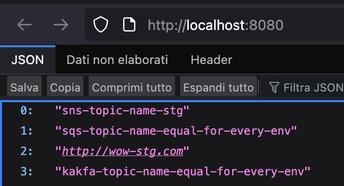

<!-- ---
  author: Marco Pegoraro
  title: Don't use the "application.properties" to manage environment variables in Spring, use this instead
  date: 2025-04-22 22:00:00
  description: "There's a better, more manageable way"
  tags: ["Java", "Spring", "Environment"] 
  header_image: /posts/managing-environment-spring/application-properties-files.png
---

Let's suppose that you have a spring application, and then you need to run this application locally in your machine, in the staging and production environment.

One of the default aproches that Java developers like to use is to create an application.properties file for each environment, like this:
<center>


</center>

And it is a fair way to segregate the environment variables by files, it's very easy for beginners to understand id and also it's easy to tell spring to use a specified file, you just need to declare the spring.profiles.active env variable in the IntelliJ run configuration with the value corresponding to the desired environment and you are good to go.
<center>


</center>

In this article, i will demonstrate a better approach that shines when you are using infrastructure as code.

For this demonstration, i created a new spring project with just spring web for us to see the variables when the application run, then i created a controller like this:

```java
@RestController
public record GetEnvVariablesController(
        @Value("${sns.topic.name}") String snsTopicName,
        @Value("${sqs.queue.name}") String sqsQueueName,
        @Value("${api.url}") String apiUrl,
        @Value("${kafka.topic.name}") String kafkaTopicName
) {

    @GetMapping
    public ResponseEntity<List<String>> get(){
        return ResponseEntity.ok(List.of(snsTopicName, sqsQueueName, apiUrl, kafkaTopicName));
    }

}
```

And then I created three files called application.properties, application-stg.properties and application-prod.properties. Each one of then have the same four variables, the only difference is the suffix in the end of the values, containing the corresponding environment:

```
sns.topic.name=sns-topic-name-local
sqs.queue.name=sqs-topic-name-local
api.url=http://wow-local.com
kafka.topic.name=kakfa-topic-name-local
```

Now, if we run the application passing the desired environment, it will run without any problem:
<center>


</center>

# How can we make it better?

W -->