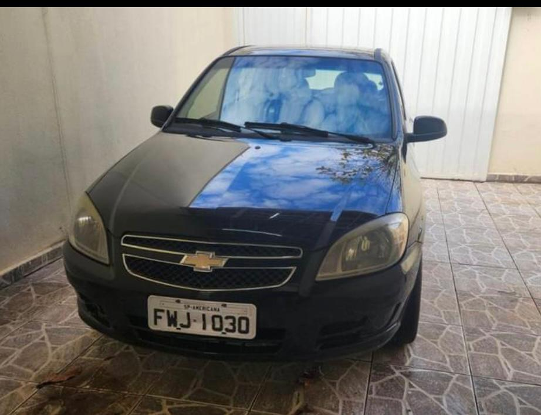
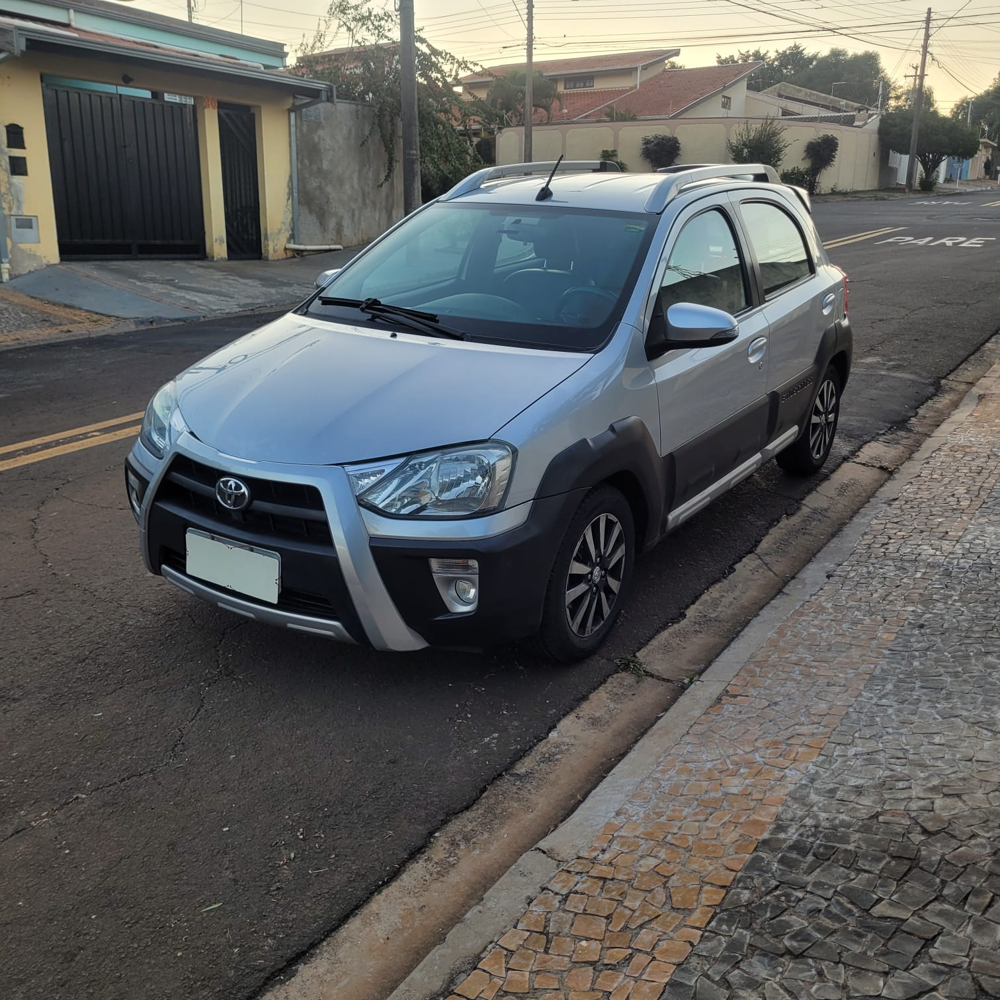

## Introduction

Ideias para posts:
	Coleção do james bond
	Como foi ter um Accord 1993
	Review Toyota etios 2017
	
	Trabalho com java a 5 anos, o que tenho a dizer sobre? 
	

I really like cars, it doesn't matter if it is an old car, or a modern car, or a sports or a basic car, i like cars in general, i believe that all cars serve purpose, and if is solving someone problem, than it is a good car.

With that said, a had a fell cars in my life, an old Civic, an old Accord(which is the car that I've had the longest), a Fiat Palio and Chevrolet Vectra(also know as Opel Astra H in europe) to say a feel. And the last car that i had before the one i have today was a Chevrolet Celta, if you are from Argentina, you may know this model as the Suzuki Fun.

Don't get me wrong, it's a great car, extremely reliable, cheap parts and good gas mileage, but it was a product made for poor countries like Brazil, so nothing luxurious, it was made using the same chassis of the Opel Corsa B, a car that was debuted in 1993. it had a 1.0 liter engine and a manual transmission, and the inside is very simple, good thing that my car had at least air conditioner and power steering, and airbags, which was mandatory to cars that were produced after 2014 in Brazil. 

So i started to look for a newer car for me, These were my prerequisites(from the highest importance to lowest):
- To cost around R$60k (approximately USD10k)
- Reliable
- Automatic transmission
- have good gas mileage
- Newer than my Chevrolet Celta

First, i looked in the internet for a car, i wasn't finding anything interesting, all de midsize sedans (for Brazil standards, in the US they are called compact sedans) were very old, for instance, a 2012 basic Toyota Corolla is around R$60K, that is very expensive, a 2012 Honda Civic is around the same price. You can find something like, a french midsize sedan like de Citroen C4 or the Peugeot 408 way newer, but these cars are not know for their reliability.

