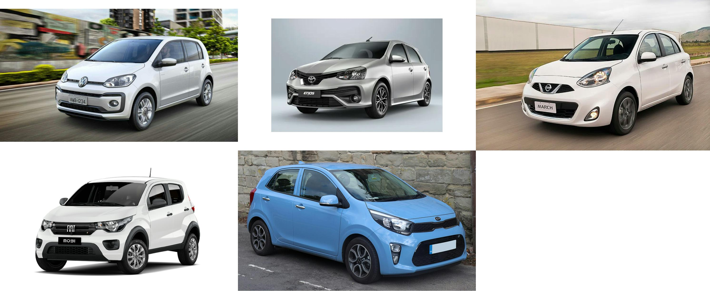
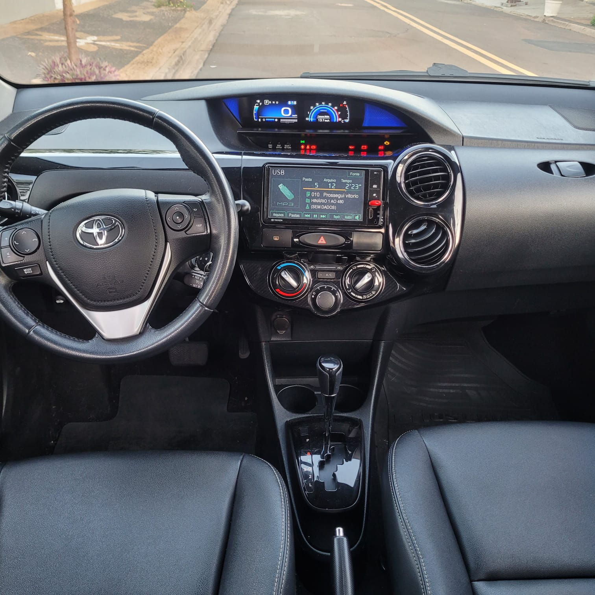
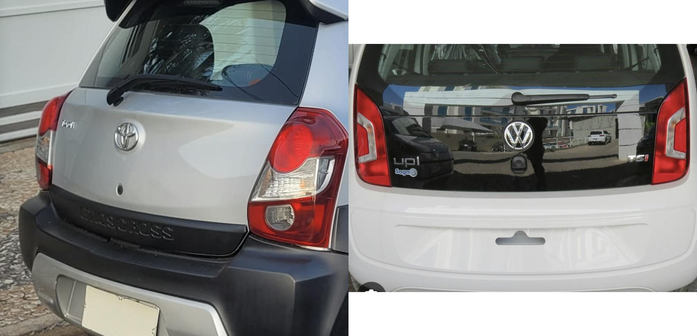

## A brief history of me and cars

I really like cars, it doesn't matter if it is an old car, or a modern car, or a sports or a basic car, i like cars in general, i believe that all cars serve purpose, and if is solving someone problem, than it is a good car.

With that said, a had a fell cars in my life, an old Civic, an old Accord(which is the car that I've had the longest), a Fiat Palio and Chevrolet Vectra(also know as Opel Astra H in europe) to say a feel. And the last car that i had before the one i have today was a Chevrolet Celta, if you are from Argentina, you may know this model as the Suzuki Fun.

Don't get me wrong, it's a great car, extremely reliable, cheap parts and good gas mileage, but it was a product made for poor countries like Brazil, so nothing luxurious, it was made using the same chassis of the Opel Corsa B, a car that was debuted in 1993. it had a 1.0 liter engine and a manual transmission, and the inside is very simple, good thing that my car had at least air conditioner and power steering, and airbags, which was mandatory to cars that were produced after 2014 in Brazil. 

## Looking for a new car

So i started to look for a newer car for me, These were my prerequisites(from the highest importance to lowest):
- To cost around R$60k (approximately USD10k)
- Reliable
- Automatic transmission
- have good gas mileage
- Newer than my Chevrolet Celta

First, i looked in the internet for a car, i wasn't finding anything interesting, all de midsize sedans (for Brazil standards, in the US they are called compact sedans) were very old, for instance, a 2012 basic Toyota Corolla is around R$60K, that is very expensive, a 2012 Honda Civic is around the same price. You can find something like, a french midsize sedan like de Citroen C4 or the Peugeot 408 way newer, but these cars are not know for their reliability.

And then i start looking for a compact car(once again, in the US are called sub compact), like the the Honda City, Toyota Yaris and the Chevrolet Onix, but all of them were also too expensive for the money i was planing to pay or older than i was looking for. Especially when looking for an automatic transmission.

Then there is a category of cars that i don't believe that exists in the US, because they are even more compact than a subcompact car in US standards, here in Brazil we called this type of car a subcompact, in europe this type of car is more common. In Brazil we have some examples, like the Volkswagen UP, Nissan March, Kia Picanto, Fiat Mobi and the Toyota Etios.

Since i do not have children, i don't travel a lot and i just want a car that works when i need it, this type of car would satisfy my need, in the examples above, the only ones that has a automatic transmission where the March, the Picanto and the Etios. The VW UP is a car that i would have, it is compact, kinda charming and it has a 1.0 turbo engine that has a good power to weight ratio, but it's only offered with a manual or a single clutch transmission, and although i wouldn't have the need to change gears with this clutch, this kinda of transmission is know in Brazil for it's bad reputation, not exclusively to Volkswagen cars but all automakers that has this kind of clutch in cars.  

I don't really like the design of the Picanto and March, i opted for the Toyota Etios, then one day when i was walking in a local used car convention where people go there to sell their own cars (i don't know if this kind of event has a specific name in english, sorry), i saw a 2017 Toyota Etios automatic that was selling for R$62k, the only thing is that it was a "cross" model, which is why it was this plastic parts around the car. 

It was a car that was only owned by one person, a Toyota salesman and it had almost all repairs done by a Toyota dealership, the owner of the car agreed to receive my Chevrolet Celta as part of the payment, so i bought the car.

## First impressions

Driving the car for the first time was a great experience overall, coming from a Chevrolet Celta, the Etios is so much better, the seats are pretty nice, not as comfortable as a Toyota Corolla seat but very comfortable still, and it's a letter seat, which is something that entry level cars usually do not have.

The automatic transmission is also great, it has only four gears, and together with the 1.5 liter engine, it is more than capable of carrying the 935kg (2061lbs) that the car weights. 

## Positive points:

I really like all the optionals that this car have, the Etios Cross is equivalent of an Etios XLS(in the line up of the year, there was the entry level Etios X, then the mid level Etios XS, the mid to high end Etios XLS and finally the Etios Platinum as the high end version), so it has a lot of things that the basic versions doesn't have, like the previous mentioned letter seat.

Here are the things that the Etios Cross has:

Come with all versions
- Onboard computer
- Power steering
- Air conditioner
- Power windows
- lock system.

Etios XS:
- Bluetooth stereo
- Cruise control (only when paring with an automatic transmission)
- Audio controls in the steering wheel
- Chrome details in the interior.

Etios XLS:
- Touch screen stereo with bluetooth (more on that later)
- Fog lights
- 15 inch alloy wheels
- Letter steering wheel and letter seats
- Rear view mirror with turn signals

Etios Cross:
- All the thing that the other versions have
- An "off-road" visual
- A roof rack

As you can see, the Etios Cross has a lot o optionals for a entry level car, and a really like the aperance of the car, it is small and quirky, kinda like a Renault Twingo of the 2010s, the center dashboard is very similar to the Twingo as well.

## Negative points

But it's not all roses with the Etios, there are some points that i didn't really like about the car, nothing that makes me regret my buy, but thinks that irritates me sometimes still.

Here are somethings that i didn't like about the car:

### Opening the trunk

There is a button on the trunk of the car that opens it electrically, which is way better then opening with a key, like it was with the Celta, but something that irritates me is the fact that when i press the button, the trunk doesn't open automatically, i need to press the button with one hand and pull the trunk up with another hand. If i press the button and then try to open, the trunk will not open, this is a very bad design

As you can see in the image above, the Etios only has a button while in the VW UP, for example, the button is there, but it has also a thing that you can grab with the same hand to open the trunk, but that's something that only Etios Hatch owners will face, because the sedan model have a lever that the driver can pull inside the vehicle that opens the trunk.  

### The touch screen stereo

One of the worst things in this car is the radio, it has a bluetooth connection, a usb to plug a flash drive and a HDMI port, an nothing else. It does not have TV, Apple Carplay, Android Auto, and it even does not have physical  volume buttons, to change the volume you need to press the up or down buttons in the steering wheel or enter in the "settings" screen in the screen and then change the volume, it has a volume icon when listen to a song, but it is only for changing the equalizer, it should be in the settings and the volume should be when you are listening to the song.

The HDMI port does not mirror your cellphone screen, my cellphone is a samsung and it kinda opens the samsung dex, but the resolution is all over the place, i didn't test it with an iPhone, but i don't have hope that will work too, so i only use the radio with bluetooth. I would rather have an regular stereo without screen instead of this touch screen, ate least i would have physical volume buttons.

### Another minor inconveniences

- Cruise control is good only when the highway is flat, otherwise the RPM goes all over the place when traveling through hills.
- The car doesn't lock the doors automatically after start driving, i need to manually press the "lock" button to lock all the doors.
- It has an anoying beep when i'm not using the seat belt, i get it, is safe, but sometimes i just wanna go to the gym near my house and when is time to drive back home, i don't wanna put the seat belts because my back hurts because i did hit my back in the training (which proves that the car has some sensor that detects when i'm moving, but instead of using this sensor to lock the doors, the car uses to beep because i'm not wearing the seat belt).
- When driving on a highway, the wind noises are very loud.

## Do I recommend the 2017 Toyota Etios?

Absolutely, it's a great car, perfect for those that want a car that will just work, just like a 1984 two door Civic, but these optionals that the Etios Cross have are not so important to me, so if i would buy an Etios, then i would prefer a newer Etios X with automatic transmission, the radio without screen is the same thing as the radio with touchscreen and i don't really like the letter seat, a cloth seat works just fine for me, you can get an 2019 basic Etios for the same price as mine, but of course, without the optionals, so it is up to you which option is better.

Thats it, i hope you liked my post about my car, i don't pretend to sell it so soon, it's such a good car that i want to own it forever, but lets see what the future will look like.

See ya.